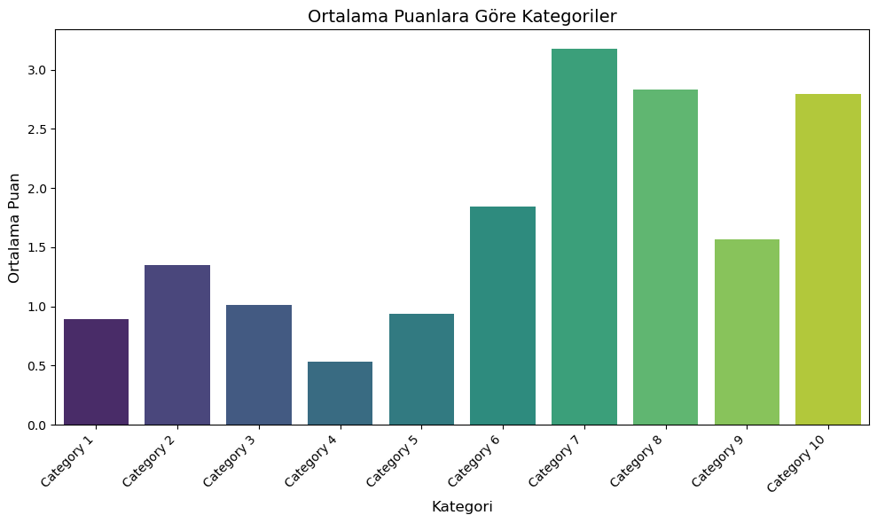
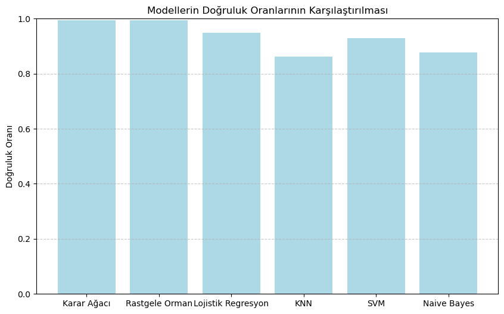
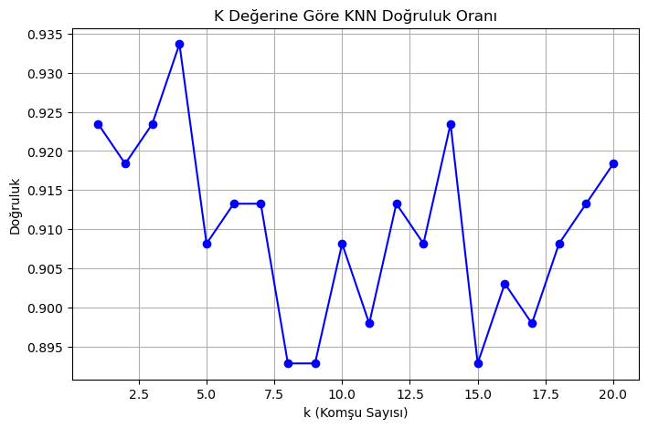
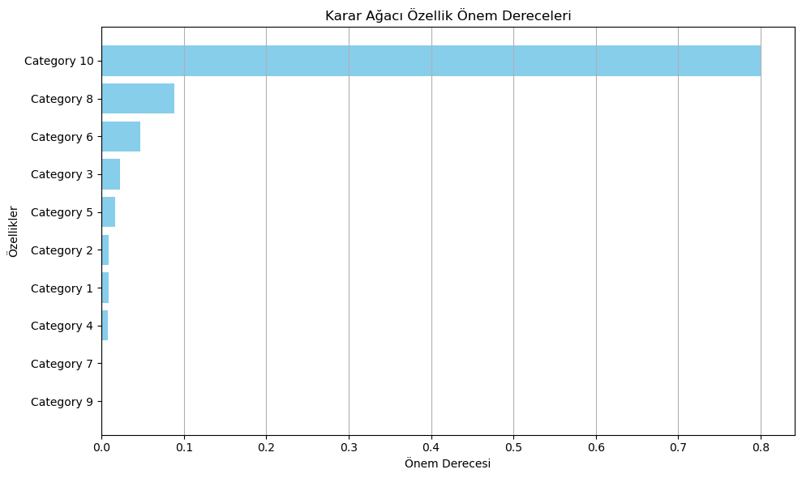

# TravelReviews: Makine Öğrenmesi ile Seyahat Verisi Sınıflandırma

TripAdvisor kullanıcılarının 10 farklı seyahat kategorisine verdiği puanlar üzerinde **6 farklı makine öğrenmesi algoritmasını** karşılaştıran bir veri bilimi projesi. Her kullanıcının en yüksek puan verdiği kategori hedef etiket olarak belirlenir ve modeller bu etiketi kullanıcının puan profilinden tahmin etmeye çalışır. Çalışma, akademik makale formatında raporlanmıştır (`Makine_Öğrenmesi_ile_Seyahat_Memnuniyeti_Tahmini[1].docx`).



## Veri Seti

[UCI Machine Learning Repository](https://archive.ics.uci.edu/) üzerindeki **Travel Reviews** veri seti kullanılmıştır (TripAdvisor kaynaklı).

| Özellik | Değer |
|---|---|
| Kullanıcı sayısı | 980 |
| Özellik sayısı | 10 kategori (kullanıcı başına ortalama puan, 0–4 aralığı) |
| Hedef değişken | Kullanıcının en yüksek puan verdiği kategori |

Kategoriler sırasıyla: sanat galerileri, dans kulüpleri, meyve suyu barları, restoranlar, müzeler, tatil köyleri, park/piknik alanları, plajlar, tiyatrolar ve dini mekanlar (`Category 1` … `Category 10`).

Hedef değişken dengeli dağılmamıştır: kullanıcıların çoğu için en yüksek puan `Category 7` (park/piknik alanları) kategorisindedir (790 kullanıcı), ardından `Category 10` gelir (161 kullanıcı).

## Yöntem

1. **Veri hazırlama:** Hedef etiketin üretilmesi (`idxmax`), `LabelEncoder` ile sayısallaştırma, %80 eğitim / %20 test ayrımı (`random_state=42`) ve Min-Max normalizasyonu.
2. **Modelleme:** Altı sınıflandırıcının eğitilmesi ve aynı test seti üzerinde karşılaştırılması.
3. **Değerlendirme:** Doğruluk (accuracy) metriği, özellik önem dereceleri, karar ağacı görselleştirmesi ve PCA ile 2 boyutlu karar sınırı grafiği.

### Sonuçlar

| Algoritma | Doğruluk |
|---|---|
| Karar Ağacı | 0.9949 |
| Rastgele Orman | 0.9949 |
| Lojistik Regresyon | 0.9490 |
| K-En Yakın Komşu (en iyi k=4) | 0.9337 |
| Destek Vektör Makineleri (SVM) | 0.9286 |
| Naive Bayes | 0.8776 |

| Model karşılaştırması | KNN için k değeri seçimi |
|---|---|
|  |  |

KNN için k değeri 1–20 aralığında denenmiş, en yüksek doğruluk k=4 ile elde edilmiştir.



### Sonuçların Yorumlanması

Hedef etiket, modelin girdi olarak aldığı kategori puanlarından türetildiği için yüksek doğruluk değerleri, modelin görevi çözme gücünden çok görevin yapısını da yansıtır. Ağaç tabanlı modellerin öne çıkması bu yüzden beklenen bir sonuçtur. Ayrıca sınıflar dengesizdir (en büyük sınıf verinin yaklaşık %81'i).

**Geliştirme fikirleri:**
- Hedef kategoriyi girdi özelliklerinden çıkararak (ör. bir kategoriyi dışarıda bırakıp onu tahmin etmek) daha anlamlı bir tahmin problemi kurmak
- Doğruluğa ek olarak F1 (macro), karışıklık matrisi ve çapraz doğrulama kullanmak
- Hiperparametre seçimini test seti yerine doğrulama seti / çapraz doğrulama ile yapmak
- Kullanıcıları kümeleme (K-Means) ile gruplayıp profil analizi yapmak

## Kullanılan Teknolojiler

- **Python 3**, **Jupyter Notebook**
- **pandas, NumPy:** veri işleme
- **scikit-learn:** KNN, Karar Ağacı, Rastgele Orman, Lojistik Regresyon, SVM, Naive Bayes, PCA, Min-Max ölçekleme
- **Matplotlib, Seaborn:** görselleştirme

## Proje Yapısı

```
TravelReviews/
├── TravelReviewsDataScience.ipynb   # Veri analizi, modelleme ve görselleştirme
├── tripadvisor_review.xls           # Veri seti (uzantısı .xls olsa da içeriği CSV'dir)
├── Makine_Öğrenmesi_ile_Seyahat_Memnuniyeti_Tahmini[1].docx   # Makale / proje raporu
├── docs/images/                     # README'deki grafikler
└── README.md
```

## Çalıştırma

```bash
git clone https://github.com/MelihAliCagman/TravelReviews.git
cd TravelReviews

pip install pandas numpy scikit-learn matplotlib seaborn jupyter

# Notebook veriyi "tripadvisor_review.csv" adıyla okur.
# Depodaki dosyanın içeriği CSV olduğu için kopyalamak yeterlidir:
cp tripadvisor_review.xls tripadvisor_review.csv

jupyter notebook TravelReviewsDataScience.ipynb
```

Hücreleri sırayla çalıştırın.

## Ekip

Üç kişilik ekiple Gazi Üniversitesi Bilgisayar Mühendisliği bölümünde geliştirilmiştir.
